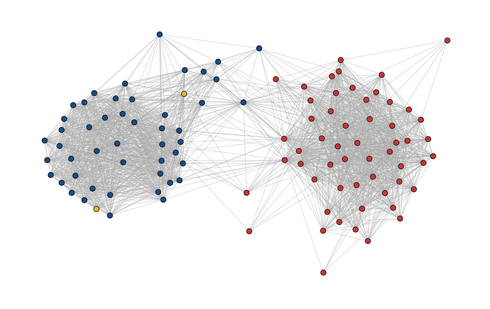

<!-- README.md is generated from README.Rmd. Please edit that file -->

```{r setup, include = FALSE}
knitr::opts_chunk$set(
  collapse = TRUE,
  comment = "#>",
  fig.path = "man/figures/README-",
  out.width = "100%"
)
```

# levelnet
 [](https://github.com/schochastics/levelnet/actions)
[](https://CRAN.R-project.org/package=levelnet)

~~levelnet is, so far, an early-stage R package that can be used to analyse two-mode networks and
specifically their one-mode projection. The main purpose is to make several methods available that
extract the *binary backbone* of a one-mode projection.~~ The package is, at the moment superseded by the
[backbone](https://cran.r-project.org/web/packages/backbone/index.html) package. The only feature not implemented in {{backbone}} is the use of the scobit model in the *stochastic degree sequence model* (SDSM) by Z. Neal ([link](https://www.sciencedirect.com/science/article/pii/S0378873314000343)). More features will be added once the 
research is done `r emo::ji("poo")`. 

## Installation

You can install the developers version of levelnet with:

```{r install, eval=FALSE}
# install.packages("remotes")
remotes::install_github("schochastics/levelnet")
```

## Example of `sdsm`

The package includes bill-cosponsorship data of the 115th Senate. Similar data was used in the
Paper by Neal an in [follow up work](http://www.sciencedirect.com/science/article/pii/S0378873317303039). The function `bipartite_from_data_frame` can be used to turn the data frame into 
a two-mode network (bipartite graph).

```{r example,warning=FALSE,message=FALSE}
library(igraph)
library(levelnet)
data("cosponsor_senate_15")
head(cosponsor_senate_15)

g <- bipartite_from_data_frame(cosponsor_senate_15,"name","bill")
```

The function `sdsm_diagnostic` checks the performance of several link functions.

```{r diagnostics,warning=FALSE,eval=TRUE}
params <- list(b0 = 1e-5,b1 = 1e-5,b2 = 1e-5,b3 = 1e-5,a = 0.8)
sdsm_diagnostic(g,verbose = FALSE,params = params)
```

The gradient function of the scobit model is very complicated and needs to be evaluated many times during the
optimization process. This and the scobit function evaluation are the main bottleneck. 

As was noted in the paper, the scobit model produces the best fit of the data.

```{r fit,eval=FALSE}
params <- list(b0 = 1e-5,b1 = 1e-5,b2 = 1e-5,b3 = 1e-5,a = 0.8)
l <- sdsm(g,proj = "true",model = "scobit",params = params)
```



