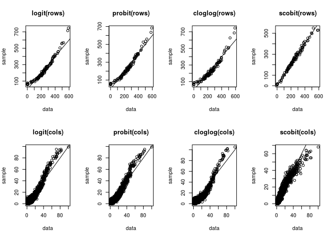
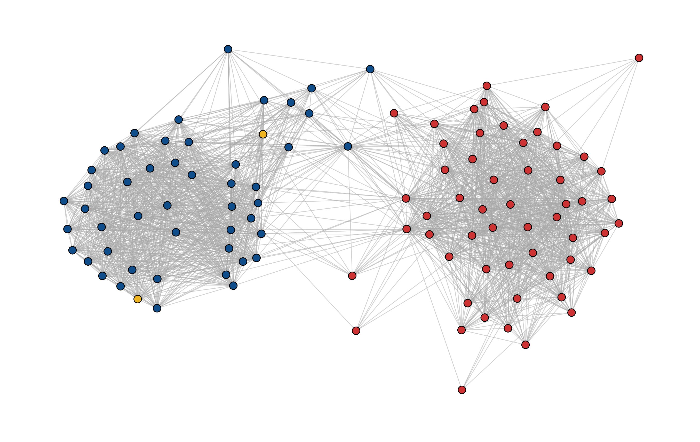

<!-- README.md is generated from README.Rmd. Please edit that file -->

# levelnet

[](https://www.tidyverse.org/lifecycle/#experimental)
[](https://travis-ci.org/schochastics/levelnet)
[](https://CRAN.R-project.org/package=levelnet)

~~levelnet is, so far, an early-stage R package that can be used to
analyse two-mode networks and specifically their one-mode projection.
The main purpose is to make several methods available that extract the
*binary backbone* of a one-mode projection.~~ The package is, at the
moment superseded by the
[backbone](https://cran.r-project.org/web/packages/backbone/index.html)
package. The only feature not implemented in {{backbone}} is the use of
the scobit model in the *stochastic degree sequence model* (SDSM) by Z.
Neal
([link](https://www.sciencedirect.com/science/article/pii/S0378873314000343)).
More features will be added once the research is done 💩.

## Installation

You can install the developers version of levelnet with:

``` r
# install.packages("remotes")
remotes::install_github("schochastics/levelnet")
```

## Example of `sdsm`

The package includes bill-cosponsorship data of the 115th Senate.
Similar data was used in the Paper by Neal an in [follow up
work](http://www.sciencedirect.com/science/article/pii/S0378873317303039).
The function `bipartite_from_data_frame` can be used to turn the data
frame into a two-mode network (bipartite graph).

``` r
library(igraph)
library(levelnet)
data("cosponsor_senate_15")
head(cosponsor_senate_15)
#>                  name party     bill
#> 1    Enzi, Michael B.     R    115s1
#> 2 Cardin, Benjamin L.     D   115s10
#> 3    Wicker, Roger F.     R   115s10
#> 4    Alexander, Lamar     R  115s100
#> 5         Franken, Al     D 115s1000
#> 6       Murray, Patty     D 115s1000

g <- bipartite_from_data_frame(cosponsor_senate_15,"name","bill")
```

The function `sdsm_diagnostic` checks the performance of several link
functions.

``` r
params <- list(b0 = 1e-5,b1 = 1e-5,b2 = 1e-5,b3 = 1e-5,a = 0.8)
sdsm_diagnostic(g,verbose = FALSE,params = params)
```



    #>      name rmse_row rmse_col   time
    #> 1   logit  32.6965  3.53625  2.481
    #> 2  probit  29.1085  3.26062  2.096
    #> 3 cloglog  38.8249  4.21584  7.336
    #> 4  scobit  15.4375  2.73470 41.794

The gradient function of the scobit model is very complicated and needs
to be evaluated many times during the optimization process. This and the
scobit function evaluation are the main bottleneck.

As was noted in the paper, the scobit model produces the best fit of the
data.

``` r
params <- list(b0 = 1e-5,b1 = 1e-5,b2 = 1e-5,b3 = 1e-5,a = 0.8)
l <- sdsm(g,proj = "true",model = "scobit",params = params)
```


